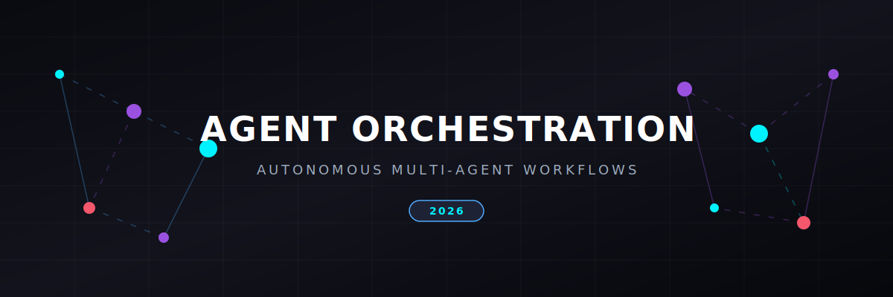

# Top AI Agent Orchestration Platforms & Frameworks (2026)

  

 
  

**A curated list of Multi-Agent Systems (MAS), Agentic Workflows, and Orchestration Frameworks for the Claude & LLM Ecosystem.**

This repository tracks the most powerful tools for building, scaling, and managing **Autonomous AI Agent Teams**. Whether you are building **Digital Assembly Lines**, implementing **Agentic RAG**, or designing **Human-on-the-Loop (HOTL)** systems, this guide covers the essential tools for 2026.

## 🚀 Trending in 2026
- **MCP (Model Context Protocol):** The standard for connecting agents to data and tools.
- **Type-Safe Agents:** Rise of frameworks like **Pydantic AI** for production-grade validation.
- **Vibe Coding:** Intent-based orchestration where agents handle the scaffolding.
- **Agent FinOps:** Observability and cost management for high-concurrency agent swarms.

---

## 🏗️ High-Control Orchestration (Deterministic)
*Best for production systems requiring strict reliability and state management.*

- **[LlamaIndex Workflows](https://github.com/run-llama/llama_index)**   
  Event-driven orchestration optimized for **Agentic RAG** and complex data retrieval missions.
- **[LangGraph](https://github.com/langchain-ai/langgraph)**   
  The 2026 industry standard for stateful, graph-based orchestration. Supports cycles, persistence, and "Time Travel" debugging.
- **[Semantic Kernel](https://github.com/microsoft/semantic-kernel)**   
  Microsoft's enterprise-grade SDK for C#, Python, and Java. Ideal for ecosystem integration.
- **[Mastra](https://github.com/mastra-ai/mastra)**   
  TypeScript-first production-grade agent framework with native Model Context Protocol (MCP) support.

## 👥 Role-Based & Multi-Agent Frameworks
*Best for collaborative teams and rapid prototyping of "Agent Crews".*

- **[Dify](https://github.com/langgenius/dify)**   
  Popular open-source LLM app development platform featuring a visual workflow designer for multi-agent coordination.
- **[CrewAI](https://github.com/crewAIInc/crewAI)**   
  The leading "Manager-Worker" framework. Extremely intuitive for defining roles, goals, and collaborative processes.
- **[ChatDev](https://github.com/OpenBMB/ChatDev)**   
  Virtual software company simulator using collaborative agents to execute complex programming tasks.
- **[smolagents](https://github.com/huggingface/smolagents)**   
  Hugging Face's minimalist, code-first approach. Focuses on tool-calling precision without abstraction bloat.
- **[Camel](https://github.com/camel-ai/camel)**   
  A communicative agent framework enabling auto-collaborative behaviors among multiple specialized roles.
- **[AutoGen 2.0 (AG2)](https://github.com/ag2ai/ag2)**   
  Next-gen conversational framework for high-concurrency, asynchronous agent interactions.
- **[Agent Teams](https://github.com/777genius/agent-teams-ai)**   
  Open-source desktop platform for orchestrating autonomous AI coding teams across Claude, Codex, and OpenCode. Give high-level commands while agents handle Kanban tasks, messaging, code review, logs, and approvals across 200+ models and 75+ LLM providers.
- **[Hephaestus](https://github.com/agentlas-ai/Hephaestus)**   
  Local Python runtime for packaging and routing coding agents and skills across Claude Code, Codex, and Cursor, with meta-agent scaffolding, ontology files, scoped memory, and policy checks.
- **[Agon](https://github.com/AutoResearch-Factory/Agon)**   
  Built on **Prompt Economy**, which treats prompt engineering as engineering and maximizes the ROI on every prompt. Runs scientist/coder/auditor loops across 10+ disciplines with just 18 core roles.

## 🛠️ Vendor-Native SDKs & Protocols
*Optimized for specific LLM providers and tool integration.*

- **[OpenAI Agents SDK](https://github.com/openai/openai-python)**   
  Streamlined orchestration for GPT-5 and Swarm-based architectures.
- **[Vercel AI SDK](https://github.com/vercel/ai)**   
  TypeScript toolkit for building structured AI responses, chat interfaces, and model routing.
- **[Pydantic AI](https://ai.pydantic.dev)**   
  Fast-growing framework for building **Type-Safe Agents** with rigorous schema validation.
- **[Claude Agent SDK](https://github.com/anthropics/anthropic-sdk-python)**   
  Native Anthropic support for **MCP (Model Context Protocol)**. Best-in-class tool use and reasoning for Claude 3.5/4 models.

## 🧰 Tools & Utilities
*Essential components for agent memory, tool-calling, and environment interaction.*

- **[Firecrawl](https://github.com/firecrawl/firecrawl)**   
  The go-to for **Browser Agents**. Turns any website into LLM-ready markdown for agentic research.
- **[Mem0](https://github.com/mem0ai/mem0)**   
  The "Personal Memory" layer for AI agents. Provides long-term persistence and personalization.
- **[LiteLLM](https://github.com/BerriAI/litellm)**   
  The standard translation proxy. Call 100+ LLMs using the OpenAI input/output format.
- **[Langfuse](https://github.com/langfuse/langfuse)**   
  Open-source LLM engineering platform providing telemetry, evaluation, prompt management, and metrics.
- **[Composio](https://github.com/composiohq/composio)**   
  The industry leader for **Agent Tool Integration**. Connects agents to 100+ apps like GitHub, Slack, and Salesforce.
- **[OpenAgentRelay](https://github.com/ShakespeareLabs/open-agent-relay)**   
  A local-first capability relay for agentic workflows that lets one agent invoke a restricted local agent or automation over a keyed trusted LAN.
- **[LangSmith](https://smith.langchain.com)**  
  The standard for **Agent Observability** and **Agent Telemetry**. Essential for debugging complex multi-agent traces.

---

## 📊 Comparison Table: Which Framework to Choose?

| Goal | Recommended Tool | Why? |
| :--- | :--- | :--- |
| **Production Reliability** | LangGraph | Stateful control & checkpoints. |
| **Visual Agent Design** | Dify | Visual node-based workflow builder. |
| **Rapid Prototyping** | CrewAI / ChatDev | Intuitive role-based DSL / simulation. |
| **Data-Heavy RAG** | LlamaIndex | Specialized in knowledge retrieval. |
| **JS/TS Integration** | Vercel AI SDK / Mastra | Native TypeScript support & SDK ecosystem. |
| **Claude Optimization** | Claude SDK + MCP | Native protocol support. |
| **Developer Experience** | Pydantic AI | Type safety and validation. |

---

## 🎓 Key Concepts & Terminology
- **Multi-Agent Orchestration (MAO):** Coordinating multiple specialized agents to solve complex tasks.
- **Digital Assembly Lines:** Sequential agentic workflows that mimic industrial pipelines.
- **Agentic RAG:** LLM agents that autonomously plan and execute multi-step research.
- **HOTL (Human-on-the-Loop):** A design pattern where humans supervise agent telemetry rather than every step.

## 🤝 How to Contribute
We welcome contributions! Please see [CONTRIBUTING.md](CONTRIBUTING.md) for guidelines.
1. Fork the repo.
2. Add your tool to the relevant section.
3. Ensure it includes a 1-sentence description and a link.

---

## 📈 Star History

*Maintained by the AI Community. Last Updated: May 2026.*
